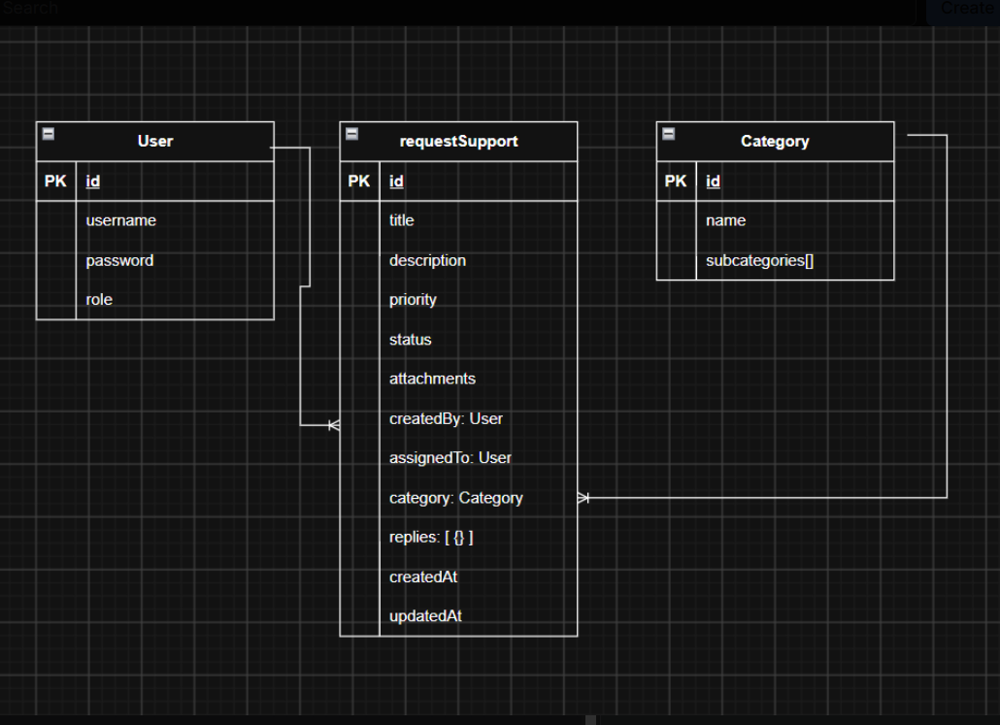

# Project Name Backend API
Government IT support System (SUPPORT)
## Overview

This repository contains the backend API for a centralized government IT support system. It allows employees to submit and track technical support requests and allows technicians to review requests, communicate with employees, and manage request progress.

The API is built with Node.js, Express, MongoDB, and Mongoose. It uses JSON Web Tokens for authentication and includes three main models: User, Category, and Request.


## Related Links

- **Backend Repository:** [Deployed Frontend URL](https://github.com/FatimaS508/project4-backend)
- **Frontend Repository:** [Frontend Github Repository URL](https://github.com/FatimaS508/project4-frontend)

## Technologies Used

- Node.js

- Express

- MongoDB

- Mongoose

- JSON Web Tokens (JWT)

- bcrypt

- dotenv

- Morgan

- CORS
- bruno api


## Features

## Features

### Authentication and Users

- Employee and technician registration

- Secure password hashing with bcrypt

- JWT-based sign-in and authentication

- Protected API routes

- Employee ID and department information

- Employee and technician roles

### Categories and Dynamic Forms

- IT support categories and embedded subcategories

- Descriptions for categories and subcategories

- Dynamic form fields for each subcategory

- Support for text, number, telephone, select, textarea, date, and file fields

### Support Requests

- Create, read, update support requests

- Automatically generated request numbers beginning at 1001

- Priority levels: Low, Medium, High, and Urgent

### Request status tracking

- Dynamic request details based on the selected subcategory

- Image attachments stored as Base64 strings

- Employee ownership through the createdBy relationship

- Technician assignment through the assignedTo relationship

- Retrieve only the requests created by the authenticated employee

- Populate employee, technician, and category information

### Replies

Employees and technicians can add replies to requests

Reply sender information is stored and populated

Technicians can delete replies

Technician replies move requests to waiting for employee confirmation

Employees can confirm that an issue has been resolved


## Project Structure

```text
backend/
├── .github/
├── config/
├── controllers/
├── middleware/
├── models/
├── routes/
├── tests/
├── app.js
├── seed.js
└── server.js
```

### Folder Responsibilities

| Folder        | Purpose                                         |
| ------------- | ----------------------------------------------- |
| `config`      | Database and application configuration          |
| `controllers` | HTTP request and response handling              |
| `middleware`  | Authentication, validation and error middleware |
| `models`      | Mongoose schemas and models                     |
| `routes`      | Express route definitions                       |
| `tests`       | Automated tests                                 |
| `app.js`      | Express application configuration               |
| `server.js`   | Database connection and server 
`seed.js`          | Seeds the database with initial categories and subcategories

## Getting Started


### Prerequisites

Install:

- node.js
- MongoDB locally or a MongoDB Atlas account

## Installation

### 1. Clone the repository

```bash
git clone BACKEND_REPOSITORY_URL
cd BACKEND_REPOSITORY_NAME
```

### 2. Install dependencies

```bash
npm install
```

### 3. Create the environment file

Create `.env` in the root directory:

```env
PORT=3000
MONGODB_URI=your-connection-string
CLIENT_URL=http://localhost:5173
JWT_SECRET=unique-password-no-one-would-guess
```
### 4. Seed the database
```bash
 node seed.js
 ```

### 5. Start the development server

```bash
npm run dev
```

The API should be available at:

```text
http://localhost:3000
```

## Database Models

## Database Models

### User

| Field            | Type   | Rules                                              |
| ---------------- | ------ | -------------------------------------------------- |
| `username`       | String | Required, unique, trimmed, lowercase               |
| `hashedPassword` | String | Required, excluded from JSON responses             |
| `role`           | String | `employee` or `technician`; defaults to `employee` |
| `createdAt`      | Date   | Generated automatically                            |
| `updatedAt`      | Date   | Generated automatically                            |

### Category

| Field                      | Type             | Rules                                                                      |
| -------------------------- | ---------------- | -------------------------------------------------------------------------- |
| `name`                     | String           | Required                                                                   |
| `about`                    | String           | Optional                                                                   |
| `subcategories`            | Array            | Array of embedded subcategory objects; defaults to `[]`                    |
| `subcategories.name`       | String           | Required and trimmed                                                       |
| `subcategories.about`      | String           | Trimmed; defaults to an empty string                                       |
| `subcategories.formFields` | Array            | Array of embedded form-field objects; defaults to `[]`                     |
| `formFields.name`          | String           | Required                                                                   |
| `formFields.label`         | String           | Required                                                                   |
| `formFields.type`          | String           | Required; `text`, `number`, `select`, `textarea`, `date`, `file`, or `tel` |
| `formFields.required`      | Boolean          | Defaults to `false`                                                        |
| `formFields.options`       | Array of Strings | Defaults to `[]`                                                           |

### Request

| Field                          | Type             | Rules                                                                              |
| ------------------------------ | ---------------- | ---------------------------------------------------------------------------------- |
| `title`                        | String           | Required                                                                           |
| `priority`                     | String           | `Low`, `Medium`, `High`, or `Urgent`; defaults to `Medium`                         |
| `status`                       | String           | `New`, `In progress`, `Waiting for confirmation`, or `Resolved`; defaults to `New` |
| `attachments`                  | Array of Strings | Optional                                                                           |
| `createdBy`                    | ObjectId         | Required; references the `User` model                                              |
| `assignedTo`                   | ObjectId         | References the `User` model; defaults to `null`                                    |
| `category`                     | ObjectId         | Required; references the `Category` model                                          |
| `subcategoryId`                | ObjectId         | Required                                                                           |
| `requestDetails`               | Mixed            | Required; stores the dynamic form answers                                          |
| `replies`                      | Array            | Array of embedded reply objects                                                    |
| `replies.message`              | String           | Required and trimmed                                                               |
| `replies.sender`               | ObjectId         | Required; references the `User` model                                              |
| `replies.attachments`          | Array            | Array of reply attachment objects                                                  |
| `replies.attachments.url`      | String           | Required                                                                           |
| `replies.attachments.fileType` | String           | Required; `image`, `document`, or `audio`                                          |
| `replies.attachments.fileName` | String           | Optional                                                                           |
| `createdAt`                    | Date             | Generated automatically                                                            |
| `updatedAt`                    | Date             | Generated automatically                                                            |


## Entity Relationships
 



## API Base URL

Local development:

```text
http://localhost:3000
```

Production:

```text
https://your-deployed-api.com
```

## Endpoints

### Products

## API Endpoints

### Users and Authentication

| Field            | Type   | Rules                                              |
| ---------------- | ------ | -------------------------------------------------- |
| `username`       | String | Required, unique, trimmed, and lowercase           |
| `hashedPassword` | String | Required                                           |
| `role`           | String | `employee` or `technician`; defaults to `employee` |
| `employeeId`     | String | Required for employees and unique                  |
| `department`     | String | Required for employees                             |
| `createdAt`      | Date   | Generated automatically                            |
| `updatedAt`      | Date   | Generated automatically                            |


### Categories

| Method | Endpoint                                   | Access        | Description         |
| ------ | ------------------------------------------ | ------------- | ------------------- |
| `GET`  | `/api/categories`                          | Authenticated | Get all categories  |
| `GET`  | `/api/categories/:id`                      | Authenticated | Get one category    |
| `GET`  | `/api/categories/subcategory/:scategoryId` | Authenticated | Get one subcategory |

### Requests
| Method   | Endpoint                                | Access        | Description                                         |
| -------- | --------------------------------------- | ------------- | --------------------------------------------------- |
| `GET`    | `/requests`                             | Authenticated | Get all requests for the technician interface       |
| `GET`    | `/requests/my`                          | Authenticated | Get only requests created by the signed-in employee |
| `GET`    | `/requests/:id`                         | Authenticated | Get one request                                     |
| `POST`   | `/requests`                             | Authenticated | Create a new support request                        |
| `PUT`    | `/requests/:id`                         | Authenticated | Update a request or its status                      |
| `DELETE` | `/requests/:id`                         | Authenticated | Delete a request                                    |
| `POST`   | `/requests/:requestId/replies`          | Authenticated | Add a reply to a request                            |
| `GET`    | `/requests/:requestId/replies`          | Authenticated | Get the replies for a request                       |
| `DELETE` | `/requests/:requestId/replies/:replyId` | Authenticated | Delete a reply                                      |


## Status Codes
Use these or any other status codes you implemented

| Status | Meaning in this API                |
| -----: | ---------------------------------- |
|  `200` | Successful request                 |
|  `201` | Resource created                   |
|  `204` | Successful deletion with no body   |
|  `400` | Invalid request                    |
|  `401` | Authentication required or invalid |
|  `403` | Authenticated but not permitted    |
|  `404` | Resource not found                 |
|  `409` | Resource conflict                  |
|  `429` | Too many requests                  |
|  `500` | Unexpected server error            |

## Testing

Run tests:

```bash
npm test
```

Tests should use a dedicated test database or an in-memory database.

## Future Enhancements
## Future Enhancements


* Send real-time notifications for request updates
* Add an admin role to control technician and employees role


## Team Members

| Name         | GitHub           | 
| ------------ | ---------------- | 
| Fatema Sami | https://github.com/FatimaS508 |


## Credits

Special thanks to **Mr. Omar Kamal** for his continuous support, patience, and guidance throughout the development of this project.
